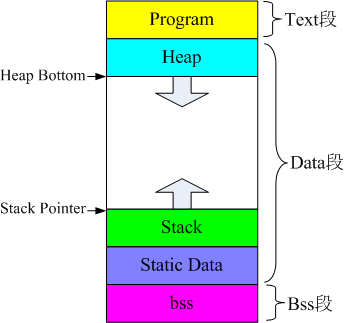

# <center><big><b>目录</b></big></center>

------

- [](NULL)
  - [数据类型](#数据类型)
  - [函数](#函数)
    - [Printf 函数](#printf-函数)
      - [格式化占位符](#格式化占位符)
    - [内存操作函数](#内存操作函数)
      - [memcpy](#memcpy)
      - [memset](#memset)
      - [malloc（memory allocation）](#mallocmemory-allocation)
      - [realloc](#realloc)
      - [calloc](#calloc)
      - [free](#free)
  - [运算符](#运算符)
    - [运算符优先级](#运算符优先级)
    - [常见运算符表达式含义](#常见运算符表达式含义)
      - [++ 与 --](#-与---)
      - [* 与 ++ 搭配](#-与--搭配)
  - [枚举类型](#枚举类型)
  - [结构体与联合体（共用体）](#结构体与联合体共用体)
    - [结构体](#结构体)
      - [结构体变量初始化](#结构体变量初始化)
      - [结构体作为函数参数](#结构体作为函数参数)
    - [联合体](#联合体)
  - [大端与小端（字节序）](#大端与小端字节序)
    - [大端小端的判断](#大端小端的判断)
    - [大端小端转换](#大端小端转换)
  - [一些关键词的使用](#一些关键词的使用)
    - [typedef 使用](#typedef-使用)
      - [typedef 的用法](#typedef-的用法)
        - [为基本数据类型定义新的类型名](#为基本数据类型定义新的类型名)
        - [为自定义数据类型（结构体、共用体和枚举类型）定义简洁的类型名称](#为自定义数据类型结构体共用体和枚举类型定义简洁的类型名称)
        - [为数组定义简洁的类型名称](#为数组定义简洁的类型名称)
        - [为指针定义简洁的名称](#为指针定义简洁的名称)
      - [typedef 使用注意要点](#typedef-使用注意要点)
      - [typedef 与 #define 的区别](#typedef-与-define-的区别)
        - [可以使用其他类型说明符对宏类型名进行扩展，但对 typedef 所定义的类型名却不能这样做](#可以使用其他类型说明符对宏类型名进行扩展但对-typedef-所定义的类型名却不能这样做)
        - [在连续定义几个变量的时候，typedef 能够保证定义的所有变量均为同一类型，而 #define 则无法保证](#在连续定义几个变量的时候typedef-能够保证定义的所有变量均为同一类型而-define-则无法保证)
    - [const 使用](#const-使用)
      - [const 修饰常量](#const-修饰常量)
      - [const 修饰指针（*）](#const-修饰指针)
      - [const 修饰函数/函数参数](#const-修饰函数函数参数)
    - [static 使用](#static-使用)
      - [static 修饰变量](#static-修饰变量)
        - [静态全局变量](#静态全局变量)
        - [静态局部变量](#静态局部变量)
      - [static 修饰函数](#static-修饰函数)
    - [extern 使用](#extern-使用)
      - [引用同一个文件中的变量](#引用同一个文件中的变量)
      - [引用另一个文件中的变量](#引用另一个文件中的变量)
      - [引用另一个文件中的函数](#引用另一个文件中的函数)
    - [register 使用](#register-使用)
  - [内存分区](#内存分区)
    - [可执行程序的三个阶段](#可执行程序的三个阶段)
    - [存储类型关键字定义变量与函数作用域与生命周期](#存储类型关键字定义变量与函数作用域与生命周期)
    - [堆与栈的区别](#堆与栈的区别)
      - [申请方式](#申请方式)
      - [申请后系统的响应](#申请后系统的响应)
      - [申请大小的限制](#申请大小的限制)
      - [申请效率的比较](#申请效率的比较)
      - [堆和栈的存储内容](#堆和栈的存储内容)
      - [存取效率的比较](#存取效率的比较)
  - [条件编译](#条件编译)
    - [#if 和 #elif 命令](#if-和-elif-命令)
    - [#ifdef 和 #ifndef 命令](#ifdef-和-ifndef-命令)
    - [defined 运算符](#defined-运算符)
  - [类型转换](#类型转换)
    - [自动类型转换](#自动类型转换)
    - [强制类型转换](#强制类型转换)
    - [算术转换](#算术转换)
  - [左值和右值](#左值和右值)
  - [指针](#指针)
    - [指针的内容](#指针的内容)
    - [指针的类型](#指针的类型)
      - [void* 类型指针](#void-类型指针)
      - [NULL指针](#null指针)
      - [零指针](#零指针)
      - [空指针](#空指针)
      - [野指针](#野指针)
      - [悬垂指针](#悬垂指针)
  - [数组](#数组)
    - [多维数组](#多维数组)

------

## 数据类型

|         数据类型          | 32位  | 64位  |    取值范围（32位情况下）    |
| :-----------------------: | :---: | :---: | :--------------------------: |
|           指针            |   4   |   8   |              -               |
|           char            |   1   |   1   |           -128~127           |
|       unsigned char       |   1   |   1   |            0~255             |
|     short int / short     |   2   |   2   |        –32,768~32,767        |
|      unsigned  short      |   2   |   2   |           0~65,535           |
|            int            |   4   |   4   | -2,147,483,648~2,147,483,647 |
|       unsigned int        |   4   |   4   |       0~4,294,967,295        |
|      long int / long      |   4   |   8   | –2,147,483,648~2,147,483,647 |
|       unsigned long       |   4   |   8   |       0~4,294,967,295        |
| long long int / long long |   8   |   8   |              ①               |
|           float           |   4   |   4   |    3.4E +/- 38 (7 digits)    |
|          double           |   8   |   8   |   1.7E +/- 308 (15 digits)   |

> unsigned char 可以当作byte使用
>
> ① -9,223,372,036,854,775,808~9,223,372,036,854,775,807

1. 求数组大小时，如果数组作为参数传递时，退化为指针，所以sizeof(arr)大小为该系统下指针的大小
2. 对于C字符串，需要牢记C/C++中一个汉字占两个字节(Linux下3个字节)
3. 求struct 或者 class 的大小时候，除了基本的数据类型大小，特别要考虑的是字节对齐问题，如果是C++的还涉及虚函数的虚表问题，需要加上虚表指针的大小

## 函数

[C语言中函数参数入栈的顺序](https://www.cnblogs.com/xkfz007/archive/2012/03/27/2420158.html)

[C语言数组当参数传递](https://blog.csdn.net/Laoynice/article/details/79196993)

### Printf 函数

```C
# include <stdio.h>
int printf(const char *format, ...);
```

#### 格式化占位符

```C
%[flags][width][.precision][length]specifier
```

<html><head><title></title></head><body><table><tbody><tr><th width="140">格式控制符</th><th>说明</th></tr><tr><td>%c</td><td>输出一个单一的字符</td></tr><tr><td>%hd、%d、%ld</td><td>以十进制、有符号的形式输出 short、int、long 类型的整数</td></tr><tr><td>%hu、%u、%lu</td><td>以十进制、无符号的形式输出 short、int、long 类型的整数</td></tr><tr><td>%ho、%o、%lo</td><td>以八进制、不带前缀、无符号的形式输出 short、int、long 类型的整数</td></tr><tr><td>%#ho、%#o、%#lo</td><td>以八进制、带前缀、无符号的形式输出 short、int、long 类型的整数</td></tr><tr><td>%hx、%x、%lx<br>%hX、%X、%lX</td><td>以十六进制、不带前缀、无符号的形式输出 short、int、long 类型的整数。如果 x 小写，那么输出的十六进制数字也小写；如果 X 大写，那么输出的十六进制数字也大写。</td></tr><tr><td>%#hx、%#x、%#lx<br>%#hX、%#X、%#lX</td><td>以十六进制、带前缀、无符号的形式输出 short、int、long 类型的整数。如果 x 小写，那么输出的十六进制数字和前缀都小写；如果 X 大写，那么输出的十六进制数字和前缀都大写。</td></tr><tr><td>%f、%lf</td><td>以十进制的形式输出 float、double 类型的小数</td></tr><tr><td>%e、%le<br>%E、%lE</td><td>以指数的形式输出 float、double 类型的小数。如果 e 小写，那么输出结果中的 e 也小写；如果 E 大写，那么输出结果中的 E&nbsp;也大写。</td></tr><tr><td>%g、%lg<br>%G、%lG</td><td>以十进制和指数中较短的形式输出 float、double 类型的小数，并且小数部分的最后不会添加多余的 0。如果 g 小写，那么当以指数形式输出时 e 也小写；如果 G 大写，那么当以指数形式输出时 E 也大写。</td></tr><tr><td>%s</td><td>输出一个字符串</td></tr></tbody></table></body></html>

<html><head><title></title><style type="text/css"> th.c1 {width:18%}</style></head><body><table><tbody><tr><th class="c1">flags（标识）</th><th>描述</th></tr><tr><td>-</td><td>在给定的字段宽度内左对齐，默认是右对齐（参见 width 子说明符）。</td></tr><tr><td>+</td><td>强制在结果之前显示加号或减号（+ 或 -），即正数前面会显示 + 号。默认情况下，只有负数前面会显示一个 - 号。</td></tr><tr><td>空格</td><td>如果没有写入任何符号，则在该值前面插入一个空格。</td></tr><tr><td>#</td><td>与 o、x 或 X 说明符一起使用时，非零值前面会分别显示 0、0x 或 0X。<br>与 e、E 和 f 一起使用时，会强制输出包含一个小数点，即使后边没有数字时也会显示小数点。默认情况下，如果后边没有数字时候，不会显示显示小数点。<br>与 g 或 G 一起使用时，结果与使用 e 或 E 时相同，但是尾部的零不会被移除。</td></tr><tr><td>0</td><td>在指定填充 padding 的数字左边放置零（0），而不是空格（参见 width 子说明符）。</td></tr></tbody></table></body></html>

<html><head><title></title><style type="text/css"> th.c1 {width:18%}</style></head><body><table><tbody><tr><th class="c1">width（宽度）</th><th>描述</th></tr><tr><td>(number)</td><td>要输出的字符的最小数目。如果输出的值短于该数，结果会用空格填充。如果输出的值长于该数，结果不会被截断。</td></tr><tr><td>*</td><td>宽度在 format 字符串中未指定，但是会作为附加整数值参数放置于要被格式化的参数之前。</td></tr></tbody></table></body></html>

<html><head><title></title><style type="text/css"> th.c1 {width:18%}</style></head><body><table><tbody><tr><th class="c1">.precision（精度）</th><th>描述</th></tr><tr><td>.number</td><td>对于整数说明符（d、i、o、u、x、X）：precision 指定了要写入的数字的最小位数。如果写入的值短于该数，结果会用前导零来填充。如果写入的值长于该数，结果不会被截断。精度为 0 意味着不写入任何字符。<br>对于 e、E 和 f 说明符：要在小数点后输出的小数位数。<br>对于 g 和 G 说明符：要输出的最大有效位数。<br>对于 s: 要输出的最大字符数。默认情况下，所有字符都会被输出，直到遇到末尾的空字符。<br>对于 c 类型：没有任何影响。<br>当未指定任何精度时，默认为 1。如果指定时不带有一个显式值，则假定为 0。</td></tr><tr><td>.*</td><td>精度在 format 字符串中未指定，但是会作为附加整数值参数放置于要被格式化的参数之前。</td></tr></tbody></table></body></html>

<html><head><title></title><style type="text/css"> th.c1 {width:18%}</style></head><body><table><tbody><tr><th class="c1">length（长度）</th><th>描述</th></tr><tr><td>h</td><td>参数被解释为短整型或无符号短整型（仅适用于整数说明符：i、d、o、u、x 和 X）。</td></tr><tr><td>l</td><td>参数被解释为长整型或无符号长整型，适用于整数说明符（i、d、o、u、x 和 X）及说明符 c（表示一个宽字符）和 s（表示宽字符字符串）。</td></tr><tr><td>L</td><td>参数被解释为长双精度型（仅适用于浮点数说明符：e、E、f、g 和 G）。</td></tr></tbody></table></body></html>

> 附加参数 -- 根据不同的 format 字符串，函数可能需要一系列的附加参数，每个参数包含了一个要被插入的值，替换了 format 参数中指定的每个 % 标签。参数的个数应与 % 标签的个数相同

### 内存操作函数

#### memcpy

c和c++使用的内存拷贝函数，`memcpy()`函数的功能是从源src所指的内存地址的起始位置开始拷贝n个字节到目标dest所指的内存地址的起始位置中。

```C
#include<string.h>
// #include<cstring>
void* memcpy(void *dest, const void *src, size_t n);
// 返回值为函数返回指向dest的指针
```

1. source 和 dest 所指的内存区域可能重叠，但是如果 source 和 dest 所指的内存区域重叠，那么这个函数并不能够确保 source 所在重叠区域在拷贝之前不被覆盖。而使用memmove可以用来处理重叠区域。函数返回指向dest的指针
2. 如果目标数组 destin 本身已有数据，执行`memcpy()`后，将覆盖原有数据（最多覆盖n）。如果要追加数据，则每次执行`memcpy()`后，要将目标数组地址增加到你要追加数据的地址

#### memset

将s所指向的某一块内存中的前n个字节的内容全部设置为ch指定的ASCII值， 第一个值为指定的内存地址，块的大小由第三个参数指定，这个函数通常为新申请的内存做初始化工作。该函数对数组操作时只能用于数组的置0或-1，其他值无效

```C
#include<memory.h>
// #include<string.h>
void* memset(void *ptr, int ch, size_t num_bytes);
// 返回值为指向s的指针
```

1. 将 ptr 中当前位置后面的 num_bytes 个字节 （typedef unsigned int size_t ）用 ch 替换并返回 ptr
2. 在一段内存块中填充某个给定的值，它是对较大的结构体或数组进行清零操作的一种最快方法

#### malloc（memory allocation）

`malloc`（动态内存分配）向系统申请分配指定size个字节的内存空间。返回类型是 void* 类型

```C
#include<stdlib.h>
// #include<malloc.h>
extern void* malloc(unsigned int num_bytes);
// 如果分配成功则返回指向被分配内存的指针(此存储区中的初始值不确定)，否则返回空指针NULL
```

1. `malloc`开辟空间所返回的首地址是动态分配的
2. `void*` 表示未确定类型的指针
3. `void*` 类型可以通过类型转换强制转换为任何其它类型的指针
4. 当内存不再使用时，应使用`free()`函数将内存块释放
5. 函数返回的指针一定要适当对齐，使其可以用于任何数据对象
6. `malloc`在分配内存时会保留一定的空间用来记录分配情况，分配的次数越多，这些记录占用的空间就越多
7. 根据`malloc`实现策略的不同，`malloc`每次在分配的时候，可能分配的空间比实际要求的多些，多次分配会导致更多的这种浪费

#### realloc

```C
#include<stdlib.h>
void* realloc(void *ptr, size_t size)
// 返回一个指针，指向重新分配大小的内存。如果请求失败，则返回 NULL
```

1. ptr 指针指向一个要重新分配内存的内存块，该内存块之前是通过调用`malloc`、`calloc`或`realloc`进行分配内存的。如果为空指针，则会分配一个新的内存块（大小为 size ），且函数返回一个指向它的指针（`void` 类型）
2. size 为内存块的新的大小，以字节为单位。如果大小为 0，且 ptr 指向一个已存在的内存块，则 ptr 所指向的内存块会被释放，并返回null
3. 如果有足够空间用于扩大 ptr 指向的内存块，则分配额外内存，并返回 ptr 。`realloc()` 是从堆上分配内存的，当扩大一块内存空间时，`realloc()` 试图直接从堆上现存的数据后面的那些字节中获得附加的字节，如果原先的内存大小后面还有足够的空闲空间用来分配，加上原来的空间大小＝ size 那么得到的会是一块连续的内存
4. 如果原先的内存大小后面没有足够的空闲空间用来分配，那么从堆中另外找一块 size 大小的内存。 并把原来大小内存空间中的内容复制到 size 中。返回新的 ptr 指针（数据被移动了）。 老块被释放放回堆。
5. 如果没有足够可用的内存用来完成重新分配（扩大原来的内存块或者分配新的内存块），则返回`null`，原来的内存块保持不变
6. **不保证调整后的内存空间和原来的内存空间保持同一内存地址**

#### calloc

分配所需的内存空间，并返回一个指向它的指针`malloc`和`calloc`之间的不同点是，`malloc`不会设置内存为零，而`calloc`会设置分配的内存为零

```C
#include <stdlib.h>
void* calloc(size_t nitems, size_t size)
// 返回一个指针，指向已分配的内存。如果请求失败，则返回 NULL
```

1. nitems 为要被分配的元素个数
2. 与`malloc`的一个相同点在于使用之后均需要`free`

#### free

指向要解分配的内存的指针，将申请来的空间的首地址还给“系统”，只要申请到了空间就一定要归还

```C
#include<stdlib.h>
void free( void* ptr );
// 无返回值
```

1. 若 ptr 为空指针，则函数不进行操作
2. 若 ptr 的值不等于之前从`malloc()`、`calloc()`、`realloc()`或`aligned_alloc()`(C11 起)返回的值，则行为未定义
3. 若 ptr 所指代的内存区域已经被解分配，则行为未定义，即是说已经以ptr 为参数调用 `free()`或`realloc()`，而且没有后继的`malloc()`、`calloc()`或`realloc()`调用以 ptr 为结果
4. 若在`free()`返回后通过指针 ptr 访问内存，则行为未定义（除非另一个分配函数恰好返回等于 ptr 的值）

## 运算符

### 运算符优先级

！ > 算术运算符 > 关系运算符 > && > || > 赋值运算符

<html><head><title></title></head><body><table><tbody><tr align="center"><th>优先级</th><th>运算符</th><th>名称或含义</th><th>使用形式</th><th>结合方向</th><th>说明</th></tr><tr align="center"><td rowspan="4">1</td><td>[]</td><td>数组下标</td><td>数组名[常量表达式]</td><td rowspan="4">左到右</td><td>--</td></tr><tr align="center"><td>()</td><td>圆括号</td><td>(表达式）/函数名(形参表)</td><td>--</td></tr><tr align="center"><td>.</td><td>成员选择(对象)</td><td>对象.成员名</td><td>--</td></tr><tr align="center"><td>-&gt;</td><td>成员选择(指针)</td><td>对象指针-&gt;成员名</td><td>--</td></tr><tr><td colspan="6"></td></tr><tr align="center"><td rowspan="9">2</td><td>-</td><td>负号</td><td>-表达式</td><td rowspan="9">右到左</td><td rowspan="7">单目运算符</td></tr><tr align="center"><td>~</td><td>按位取反</td><td>~表达式</td></tr><tr align="center"><td>++</td><td>自增</td><td>++变量名/变量名++</td></tr><tr align="center"><td>--</td><td>自减</td><td>--变量名/变量名--</td></tr><tr align="center"><td>*</td><td>取值</td><td>*指针变量</td></tr><tr align="center"><td>&amp;</td><td>取地址</td><td>&amp;变量名</td></tr><tr align="center"><td>!</td><td>逻辑非</td><td>!表达式</td></tr><tr align="center"><td>(类型)</td><td>强制类型</td><td>(数据类型)表达式</td><td>--</td></tr><tr align="center"><td>sizeof</td><td>长度运算符</td><td>sizeof(表达式)</td><td>--</td></tr><tr><td colspan="6"></td></tr><tr align="center"><td rowspan="3">3</td><td>/</td><td>除</td><td>表达式/表达式</td><td rowspan="3">左到右</td><td rowspan="3">双目运算符</td></tr><tr align="center"><td>*</td><td>乘</td><td>表达式*表达式</td></tr><tr align="center"><td>%</td><td>余数(取模)</td><td>整型表达式%整型表达式</td></tr><tr align="center"><td rowspan="2">4</td><td>+</td><td>加</td><td>表达式+表达式</td><td rowspan="2">左到右</td><td rowspan="2">双目运算符</td></tr><tr align="center"><td>-</td><td>减</td><td>表达式-表达式</td></tr><tr align="center"><td rowspan="2">5</td><td>&lt;&lt;</td><td>左移</td><td>变量&lt;&lt;表达式</td><td rowspan="2">左到右</td><td rowspan="2">双目运算符</td></tr><tr align="center"><td>&gt;&gt;</td><td>右移</td><td>变量&gt;&gt;表达式</td></tr><tr><td colspan="6"></td></tr><tr align="center"><td rowspan="4">6</td><td>&gt;</td><td>大于</td><td>表达式&gt;表达式</td><td rowspan="4">左到右</td><td rowspan="4">双目运算符</td></tr><tr align="center"><td>&gt;=</td><td>大于等于</td><td>表达式&gt;=表达式</td></tr><tr align="center"><td>&lt;&lt;/td&gt;</td><td>小于</td><td>表达式&lt;表达式</td></tr><tr align="center"><td>&lt;=</td><td>小于等于</td><td>表达式&lt;=表达式</td></tr><tr><td colspan="6"></td></tr><tr align="center"><td rowspan="2">7</td><td>==</td><td>等等于</td><td>表达式==表达式</td><td rowspan="2">左到右</td><td rowspan="2">双目运算符</td></tr><tr align="center"><td>!=</td><td>不等于</td><td>表达式!=表达式</td></tr><tr><td colspan="6"></td></tr><tr align="center"><td>8</td><td>&amp;</td><td>按位与</td><td>表达式&amp;表达式</td><td>左到右</td><td>双目运算符</td></tr><tr align="center"><td>9</td><td>^</td><td>按位异或</td><td>表达式^表达式</td><td>左到右</td><td>双目运算符</td></tr><tr align="center"><td>10</td><td>|</td><td>按位或</td><td>表达式|表达式</td><td>左到右</td><td>双目运算符</td></tr><tr align="center"><td>11</td><td>&amp;&amp;</td><td>逻辑与</td><td>表达式&amp;&amp;表达式</td><td>左到右</td><td>双目运算符</td></tr><tr align="center"><td>12</td><td>||</td><td>逻辑或</td><td>表达式||表达式</td><td>左到右</td><td>双目运算符</td></tr><tr><td colspan="6"></td></tr><tr align="center"><td>13</td><td>?:</td><td>条件运算符</td><td>表达式1?表达式2:表达式3</td><td>右到左</td><td>三目运算符</td></tr><tr><td colspan="6"></td></tr><tr align="center"><td rowspan="11">14</td><td>=</td><td>赋值</td><td>变量=表达式</td><td rowspan="11">右到左</td><td>--</td></tr><tr align="center"><td>/=</td><td>除后赋值</td><td>变量/=表达式</td><td>--</td></tr><tr align="center"><td>*=</td><td>乘后赋值</td><td>变量*=表达式</td><td>--</td></tr><tr align="center"><td>%=</td><td>取模后赋值</td><td>变量%=表达式</td><td>--</td></tr><tr align="center"><td>+=</td><td>加后赋值</td><td>变量+=表达式</td><td>--</td></tr><tr align="center"><td>-=</td><td>减后赋值</td><td>变量-=表达式</td><td>--</td></tr><tr align="center"><td>&lt;&lt;=</td><td>左移后赋值</td><td>变量&lt;&lt;=表达式</td><td>--</td></tr><tr align="center"><td>&gt;&gt;=</td><td>右移后赋值</td><td>变量&gt;&gt;=表达式</td><td>--</td></tr><tr align="center"><td>&amp;=</td><td>按位与后赋值</td><td>变量&amp;=表达式</td><td>--</td></tr><tr align="center"><td>^=</td><td>按位异或后赋值</td><td>变量^=表达式</td><td>--</td></tr><tr align="center"><td>|=</td><td>按位或后赋值</td><td>变量|=表达式</td><td>--</td></tr><tr><td colspan="6"></td></tr><tr align="center"><td>15</td><td>，</td><td>逗号运算符</td><td>表达式,表达式,…</td><td>左到右</td><td>--</td></tr></tbody></table></body></html>

> 同一优先级的运算符，运算次序由结合方向所决定
> `*`默认会和左侧的变量类型相结合

### 常见运算符表达式含义

#### ++ 与 --

++：自增运算符，整数值增加 1
> ++ 在前面叫做前自增（例如: ++a）,前自增先进行自增运算，再进行其他操作;
>
> ++ 在后面叫做后自增（例如: a++）,后自增先进行其他操作，再进行自增运算;

--：自减运算符，整数值减少 1
> -- 在前面叫做前自减（例如: --a）,前自减先进行自减运算，再进行其他操作;
>
> -- 在后面叫做后自减（例如: a--）,后自减先进行其他操作，再进行自减运算;

在一个独立的语句中，`++`书写在变量之后和之前的没有区别

无论前`++`，后`++`，最后都会自增1，区别在于是先自增再参与运算，还是先参与运算再加1操作(自减与自增类似)

[为什么说++i比i++效率高？](https://blog.51cto.com/u_13260163/3250795)

[为什么 Python、Ruby 等语言弃用了自增运算符？](https://www.51cto.com/article/716410.html)

#### * 与 ++ 搭配

```C
// 1. *p++
int a = *p++; // 取出值，然后指针后自增
printf("&a = 0X%X, a = %d\n", &a, a);
printf("&p = 0X%X, p = %d\n", p, *p);
// 输出：
// &p = 0X117FFBB0, p = 1
// &a = 0X117FFBAC, a = 1
// &p = 0X117FFBB4, p = 4
/* ---------------- */
// 2. *(p++)
int a = *(p++); // 取出值，然后指针后自增
printf("&a = 0X%X, a = %d\n", &a, a);
printf("&p = 0X%X, p = %d\n", p, *p);
// 输出：
// &p = 0X531FF6C0, p = 1
// &a = 0X531FF6BC, a = 1
// &p = 0X531FF6C4, p = 4
/* ---------------- */
// 3. (*p)++
int a = (*p)++; // 先取值，然后值后自增
printf("&a = 0X%X, a = %d\n", &a, a);
printf("&p = 0X%X, p = %d\n", p, *p);
// 输出：
// &p = 0X281FF710, p = 1
// &a = 0X281FF70C, a = 1
// &p = 0X281FF710, p = 2
/* ---------------- */
// 4. ++*p
int a = ++*p; // 先取值，然后值前自增
printf("&a = 0X%X, a = %d\n", &a, a);
printf("&p = 0X%X, p = %d\n", p, *p);
// 输出：
// &p = 0XADBFFB60, p = 1
// &a = 0XADBFFB5C, a = 2
// &p = 0XADBFFB60, p = 2
/* ---------------- */
// 5. ++(*p)
int a = ++(*p); // 先取值，然后值前自增
printf("&a = 0X%X, a = %d\n", &a, a);
printf("&p = 0X%X, p = %d\n", p, *p);
// 输出：
// &p = 0X491FF700, p = 1
// &a = 0X491FF6FC, a = 2
// &p = 0X491FF700, p = 2
```

## 枚举类型

枚举类型是一种基本数据类型，而不是一种构造类型，因为它不能再分解为任何基本类型

在C 语言中，枚举类型是被当做`int`或者`unsigned int`类型来处理的，所以按照 C 语言规范是没有办法遍历枚举类型的

```C
enum 枚举名
{
    枚举值表
}枚举变量;
```

> 第一个枚举成员的默认值为整型的 0，后续枚举成员的值在前一个成员上加 1

## 结构体与联合体（共用体）

### 结构体

结构体是一种集合，它里面包含了多个变量或数组，它们的类型可以相同，也可以不同，每个这样的变量或数组都称为结构体的成员

结构体是一种数据类型，是一种创建变量的模板，编译器不会为它分配内存空间，就像`int`、`float`、`char`这些关键字本身不占用内存一样；结构体变量才包含实实在在的数据，才需要内存来存储

要想取得结构体变量的地址，必须在前面加&
> struct stu *pstu = &stu1;

```C
struct tag {
    member-list
    member-list
    member-list
    ...
} variable-list ;
```

> 在一般情况下，tag、member-list、variable-list 这 3 部分至少要出现 2 个

#### 结构体变量初始化

和其它类型变量一样，对结构体变量可以在定义时指定初始值

```C
struct Books
{
   char  title[50];
   char  author[50];
   char  subject[100];
   int   book_id;
} book = {"C 语言", "RUNOOB", "编程语言", 123456};
```

#### 结构体作为函数参数

可以把结构作为函数参数，传参方式与其他类型的变量或指针类似

结构体变量名代表的是整个集合本身，作为函数参数时传递的整个集合，也就是所有成员，而不是像数组一样被编译器转换成一个指针。如果结构体成员较多，尤其是成员为数组时，传送的时间和空间开销会很大，影响程序的运行效率。所以最好的办法就是使用结构体指针，这时由实参传向形参的只是一个地址，非常快速

### 联合体

联合是一个在同一个存储空间里存储不同类型数据的数据类型。这些存储区的地址都是一样的，联合里不同存储区的内存是重叠的，修改了任何一个其他的会受影响

共用体在一般的编程中应用较少，在单片机中应用较多

```C
union U
{
    char s[9]; // 9字节
    int n;     // 4字节
    double d;  // 8字节
};
// sizeof(U) -> 16 (字节对齐问题)
```

1. 联合体是一个结构

2. 它的所有成员相对于基地址的偏移量都为0，联合体的访问不论对哪个变量的存取都是从 union 的首地址位置开始

3. 此结构空间要大到足够容纳最"宽"的成员（所占的空间等于其最大的成员所占的空间）

4. 其对齐方式要适合其中所有的成员（大小能被其包含的所有基本数据类型的大小所整除）

## 大端与小端（字节序）

大端小端是不同的字节顺序存储方式，统称为字节序

如果需要逐位运算，或者需要到从个位数开始运算，都是小端序占优势。反之，如果运算只涉及到高位，或者数据的可读性比较重要，则是大端序占优势

位(bit)：计算机中的最小数据单位，计算机存储的都是二进制0和1

字节(Byte)：字节是存储空间的基本计量单位，也是内存的基本单位，也是编址单位。例如，一个计算机的内存是4GB，就是该计算机的内存中共有4×1024×1024×1024个字节，意味着它有4G的内存寻址空间

1. 数据在寄存器中都是以大端模式次序存放的
2. 大端存储次序还广泛运用在 TCP/IP 协议上，因此又称为**网络字节次序**
3. 内存中主要以小端模式存放数据（**主机字节次序**）。CPU存取数成时，小端和大端之间的转换是通过硬件实现的，没有数据加载/存储的开销
4. 大小端主要由 CPU 决定，与编译器、操作系统这些没有直接关系。有些ARM处理器还可以由硬件来选择是大端模式还是小端模式
5. 大小端主要有用于存储的顺序，与存储器（硬件）关系比较

大端（Big-Endian）模式：高位字节排放在内存的低地址端，低位字节排放在内存的高地址端
> 符号位的判定固定为第一个字节，容易判断正负

小端（Little-Endian）模式：低位字节排放在内存的低地址端，高位字节排放在内存的高地址端
> 强制转换数据不需要调整字节内容，1、2、4字节的存储方式一样

例如数字 0x12 34 56 78在内存中的表示形式

| 模式 \ 内存地址 | 低地址 |  ---  | --->  | 高地址 |
| :-------------: | :----: | :---: | :---: | :----: |
|      大端       |  0x12  | 0x34  | 0x56  |  0x78  |
|      小端       |  0x78  | 0x56  | 0x34  |  0x12  |

### 大端小端的判断

```C
#include <stdio.h>
int main(void)
{
    union
    {
        short i;
        char a[2];
    } u;
    u.a[0] = 0x11; // 低地址
    u.a[1] = 0x22; // 高地址
    printf("0x%x\n", u.i); // 0x2211 为小端  0x1122 为大端
    return 0;
}
// 输出结果： 0x2211
```

### 大端小端转换

```C
#include <arpa/inet.h>
htonl() //32位无符号整型的主机字节顺序到网络字节顺序的转换（小端->>大端）
htons() //16位无符号短整型的主机字节顺序到网络字节顺序的转换 （小端->>大端）
ntohl() //32位无符号整型的网络字节顺序到主机字节顺序的转换 （大端->>小端）
ntohs() //16位无符号短整型的网络字节顺序到主机字节顺序的转换 （大端->>小端）
```

## 一些关键词的使用

### typedef 使用

为类型取一个新的名字

#### typedef 的用法

##### 为基本数据类型定义新的类型名

系统默认的所有基本类型都可以利用`typedef`关键字来重新定义类型名，可以使用这种方法来定义与平台无关的类型

比如，要定义一个叫 REAL 的浮点类型，在目标平台一上，让它表示最高精度的类型

当跨平台移植程序时，我们只需要修改一下`typedef`的定义即可，而不用对其他源代码做任何修改

```C
typedef long double REAL;
// 不支持 long double 的平台二上，改为
typedef double REAL;
// 在 double 都不支持的平台三上，改为
typedef float REAL;
```

##### 为自定义数据类型（结构体、共用体和枚举类型）定义简洁的类型名称

定义一个名为 Point 的结构体

```C
struct Point
{
    double x;
    double y;
    double z;
};
struct Point oPoint1={100，100，0};
struct Point oPoint2;

// 使用 typedef
typedef struct tagPoint
{
    double x;
    double y;
    double z;
} Point;
Point oPoint1={100，100，0};
Point oPoint2;

// 在定义结构体时，使用此结构体时要加上 struct 关键词
typedef struct tagNode
{
    char* pItem;
    struct tagNode* pNext;
}*pNode;

```

##### 为数组定义简洁的类型名称

```C
typedef int INT_ARRAY_100[100];
INT_ARRAY_100 arr;
```

##### 为指针定义简洁的名称

```C
typedef char* PCHAR;
PCHAR pa;

// PFun是我们创建的一个类型别名
typedef int *(*PFun)(int,char*);
// 使用定义的新类型来声明对象，等价于int*(*a[5])(int,char*);
PFun a[5];
```

#### typedef 使用注意要点

```C
typedef char* PCHAR;
int strcmp(const PCHAR,const PCHAR);
// 此时，相当于“char*const”，而不是“const char*（指向常量 char 的指针）”
// 让 const PCHAR 相当于 const char* ，如下面的代码所示
typedef const char* PCHAR;
int strcmp(PCHAR， PCHAR);
```

虽然`typedef`并不真正影响对象的存储特性，但在语法上它还是一个存储类的关键字，就像 `auto`、`extern`、`static`和`register`等关键字一样

下面这种声明方式是不可行的：

```C
typedef static int INT_STATIC;
```

#### typedef 与 #define 的区别

##### 可以使用其他类型说明符对宏类型名进行扩展，但对 typedef 所定义的类型名却不能这样做

```C
#define INTERGE int
unsigned INTERGE n;  //没问题

typedef int INTERGE;
unsigned INTERGE n;  //错误，不能在 INTERGE 前面添加 unsigned
```

##### 在连续定义几个变量的时候，typedef 能够保证定义的所有变量均为同一类型，而 #define 则无法保证

```C
#define PTR_INT int *
PTR_INT p1, p2;
// int *p1, p2;
// 使得 p1、p2 成为不同的类型：p1 是指向 int 类型的指针，p2 是 int 类型

typedef int * PTR_INT
PTR_INT p1, p2;
// p1、p2 类型相同，它们都是指向 int 类型的指针
```

### const 使用

`const`意为常量，被其修饰的变量的值将不得修改，所以常量必须在定义的同时赋值（初始化），后面的任何赋值行为都将引发错误

将非`const`类型转换为`const`类型是允许的

使用`const`修饰过的局部变量就有了静态特性，它的生存周期也是程序运行的整个过程
> 用`const`修饰过的局部变量只是有了静态特性，并没有说它变成了静态变量

#### const 修饰常量

```C
#include <stdio.h>
int getNum(){
    return 100;
}
int main(){
    int n = 90;
    const int MaxNum1 = getNum(); //运行时初始化
    const int MaxNum2 = n;        //运行时初始化
    const int MaxNum3 = 80;       //编译时初始化
    printf("%d, %d, %d\n", MaxNum1, MaxNum2, MaxNum3);
    return 0;
}
```

#### const 修饰指针（*）

```C
const int *p1;        // 修饰指针指向的内容（常用形式）
int const *p2;        // 修饰指针指向的内容
int * const p3;       // 修饰指针
const int * const p4; // 修饰指针和指针指向的内容
```

#### const 修饰函数/函数参数

如果形参是一个指针，为了防止在函数内部修改指针指向的数据，就可以用`const`来限制

当`const`在函数名前面的时候修饰的是函数返回值，函数返回值（即指针）的内容不能被修改，该返回值只能被赋给加`const`修饰的同类型指针
> 如果输入参数采用“值传递”，由于函数将自动产生临时变量用于复制该参数，该输入参数本来就无需保护，所以不要加`const`修饰
>
> 如果参数作为输出参数，不论它是什么数据类型，也不论它采用“指针传递”还是“引用传递”，都不能加`const`修饰，否则该参数将失去输出功能（因为有`const`修饰之后，不能改变他的值）
>
> 如果参数作为输入参数，可以防止数据被改变，起到保护作用，增加程序的健壮性

在函数名后面表示是 C++ 常成员函数，该函数不能修改对象内的任何成员，只能发生读操作，不能发生写操作

### static 使用

#### static 修饰变量

在使用`static`关键字修饰变量时，我们称此变量为静态变量

静态变量与全局变量也一样，它们都存储在静态数据区中，因此其变量的值默认也为0

##### 静态全局变量

全局变量虽然属于静态存储方式，但并不是静态变量，它必须由`static`加以定义后才能成为静态全局变量

全局变量的作用域是整个源程序，当一个源程序由多个源文件组成时，全局变量在各个源文件中都是有效的

通过在全局变量之前加上关键字`static`使全局变量被定义成为一个静态全局变量，实现限制全局变量只在所处的源文件生效，这样就可以避免在其他源文件中引起的错误。也就起到了对其他源文件进行隐藏与隔离错误的作用，有利于模块化程序设计、

##### 静态局部变量

静态局部变量的值在函数调用结束之后不会消失，仍然保留其原值。它所占用的存储单元不会释放，在下一次调用该函数时，其局部变量的值仍然存在，也就是上一次函数调用结束时的值

将局部变量声明为静态局部变量的时候，改变了局部变量的存储位置，即从原来的栈中存放改为静态存储区存放
> 静态局部变量与全局变量的主要区别就在于可见性，静态局部变量只在其被声明的代码块中是可见的
>
> 使用静态局部变量最好的示例就是实现统计次数的功能

#### static 修饰函数

`static`函数与普通函数作用域不同,仅在本文件
> 只在当前源文件中使用的函数应该说明为内部函数(`static`修饰的函数)，内部函数应该在当前源文件中说明和定义。对于可在当前源文件以外使用的函数，应该在一个头文件中说明，要使用这些函数的源文件要包含这个头文件.

`static`函数在内存中只有一份，普通函数在每个被调用中维持一份拷贝

### extern 使用

利用关键字 `extern`，可以在一个文件中引用另一个文件中定义的变量或者函数

如果该函数或者变量与开放给外面，则在h文件中用 `extern` 加以声明。因此外部文件只用include 该`.h`文件就可以了

对于`extern`变量来说，仅仅是一个变量的声明，其并不是在定义分配内存空间。如果该变量定义多次，会有连接错误

#### 引用同一个文件中的变量

#### 引用另一个文件中的变量

> 只有当一个变量是一个全局变量时，`extern` 变量才会起作用（且要放在*.h中）

使用 include 将另一个文件全部包含进去可以引用另一个文件中的变量，但是这样做的结果就是，被包含的文件中的所有的变量和方法都可以被这个文件使用，这样就变得不安全，如果只是希望一个文件使用另一个文件中的某个变量还是使用`extern`关键字

#### 引用另一个文件中的函数

对函数的`extern`用法和对全局变量的修饰基本相同，需要注意的就是，需要指明返回值的类型和参数

### register 使用

请求编译器尽可能的将变量存在CPU内部寄存器中，而不是通过内存寻址访问，以提高效率

1. 待声明为寄存器变量类型应该是CPU寄存器所能接受的类型，意味着寄存器变量是单个变量，变量长度应该小于等于寄存器长度
2. 不能对寄存器变量使用取地址符“&”，因为该变量没有内存地址
3. 尽量在大量频繁的操作时使用寄存器变量，且声明的变量个数应该尽量的少
4. 只有局部自动变量和形式参数可以作为寄存器变量，其它（如全局变量）不行
5. 局部静态变量不能定义为寄存器变量
6. 由于寄存器的数量有限（不同的cpu寄存器数目不一），不能定义任意多个寄存器变量，而且某些寄存器只能接受特定类型的数据（如指针和浮点数），因此真正起作用的register修饰符的数目和类型都依赖于运行程序的机器，而任何多余的register修饰符都将被编译程序所忽略

## 内存分区



1. 栈区（stack）:存放函数形参和局部变量（auto类型），由编译器自动分配和释放。
2. 堆区（heap）:该区由程序员申请后使用，需要手动释放否则会造成内存泄漏。如果程序员没有手动释放，那么程序结束时可能由OS回收。
3. 全局/静态存储区：存放全局变量和静态变量（包括静态全局变量与静态局部变量），初始化的全局变量和静态局部变量放在一块，未初始化的放在另一块。
4. 文字常量区：常量在统一运行被创建，常量区的内存是只读的，程序结束后由系统释放。
5. 程序代码区：存放程序的二进制代码，内存由系统管理

### 可执行程序的三个阶段

代码段，数据段，堆栈段是cpu级别的概念，五大分区属于语言级别的概念，两者是不同的概念
> text段在内存中被映射为只读，但date段与bss段是可写的

- text段：代码段，就是放程序代码的，编译时确定，只读
- date段：存放在编译阶段（而非运行时）就能确定的数据，可读可写。也就是通常所说的静态存储区，赋了初值的全局变量和赋初值的静态变量存放在这个区域，常量也存在这个区域
- bss段：已经定义但没赋初值的全局变量和静态变量存放在这个区域

### 存储类型关键字定义变量与函数作用域与生命周期

|      类型       |  作用域  |    生命周期    |              存储位置               |
| :-------------: | :------: | :------------: | :---------------------------------: |
|    auto 变量    | 一对{}内 |    当前函数    |                栈区                 |
| static 局部变量 | 一对{}内 | 整个程序运行期 | 初始化在 data 段，未初始化在 BSS 段 |
|   extern 变量   | 整个程序 | 整个程序运行期 | 初始化在 data 段，未初始化在 BSS 段 |
| static 全局变量 | 当前文件 | 整个程序运行期 | 初始化在 data 段，未初始化在 BSS 段 |
|   extern 函数   | 整个程序 | 整个程序运行期 |               代码区                |
|   static 函数   | 当前文件 | 整个程序运行期 |               代码区                |
|  register 变量  | 一对{}内 |    当前函数    |       运行时存储在 CPU 寄存器       |
|   字符串常量    | 当前文件 | 整个程序运行期 |               data 段               |

### 堆与栈的区别

#### 申请方式

stack: 栈由系统自动分配，自动开辟空间

heap: 堆由程序员自己申请并指明大小，c中`malloc`,c++中`new`。

```C
p1=(char*)malloc(10);p2=(char*)new(10);
// p1,p2 本身是在栈中的
```

#### 申请后系统的响应

栈：只要栈的剩余空间大于所申请空间，系统将为程序提供内存，否则将报异常提示栈溢出

堆：首先操作系统有一个记录空闲内存地址的链表，当系统收到程序的申请时，会遍历该链表，寻找第一个大于所申请空间的堆节点，然后将该节点从空闲节点链表中删除，并将该节点的空间分配给程序。另外对于大部分系统，会在这块内存空间中的首地址处记录本次分配的大小，这样代码中的delete语句才能正确的释放本内存空间。另外由于找到的堆节点大小不一定正好等于申请的大小，系统会自动的将多余的那部分重新放入空闲链表中

#### 申请大小的限制

栈：在windows下栈是向低地址扩展的数据结构，是一块连续的内存区域。所以栈的栈顶地址和最大容量是系统预先设定好的。在windows下栈的大小是2M.因此能从栈获得的空间比较小

堆：堆是向高地址扩展的数据结构，是不连续的内存区域。这是是由于系统用链表来存储空闲内存地址的，所以是不连续的。而链表的遍历方向是由低地址到高地址。堆得大小受限于计算机系统中有效的虚拟内存大小。相比较而言堆获得的空间比较灵活，也比较大

#### 申请效率的比较

栈：由系统自动分配，速度较快，但程序员是无法控制的

堆：由new分配的内存，一般速度比较慢，而且比较容易产生内存碎片，不过用起来最方便

#### 堆和栈的存储内容

栈：在函数调用时，第一个进栈的是主函数中的下一条指令（函数调用语句的下一条可执行语句）的地址，然后是函数的各个参数。在大多数c编译器中，参数是由右往左压栈的，然后是函数中的局部变量。静态变量是不入栈的。当函数调用结束后，局部变量先出栈，然后是参数，最后栈顶指针指向最开始存的地址，也就是主函数的下一条指令，程序由该点继续执行

堆：一般是在堆的头部用一个字节存放堆得大小，其他内容自己安排

#### 存取效率的比较

```C
char str1[]="aaaaaa";
// 第一行是在运行时刻赋值的
char *str2="cccccc";
// 第二行是在编译时就已经确定的，但在以后的存取过程中，在栈上的数组比指针指向的字符串快
```

## 条件编译

条件编译是指预处理器根据条件编译指令，有条件地选择源程序代码中的一部分代码作为输出，送给编译器进行编译。主要是为了有选择性地执行相应操作，防止宏替换内容（如文件等）的重复包含

条件编译区域以`#if`、`#ifdef`或`#ifndef`等命令作为开头，以`#endif`命令结尾。条件编译区域可以有任意数量的`#elif`命令，但最多一个`#else`命令

以`#`开头的都是预编译指令，就是在正式编译之前，编译器做一些预处理的工作

| 条件编译指令 |                      说明                      |
| :----------: | :--------------------------------------------: |
|      #       |               空指令，无任何效果               |
|     #if      |          如果条件为真，则执行相应操作          |
|    #elif     | 如果前面条件为假，而该条件为真，则执行相应操作 |
|    #else     |       如果前面条件均为假，则执行相应操作       |
|    #endif    |             结束相应的条件编译指令             |
|   #include   |               包含一个源代码文件               |
|   #define    |                     定义宏                     |
|    #undef    |                 取消已定义的宏                 |
|    #ifdef    |         如果该宏已定义，则执行相应操作         |
|   #ifndef    |        如果该宏没有定义，则执行相应操作        |
|    #error    |             停止编译并显示错误信息             |

### #if 和 #elif 命令

作为 #if 或 #elif 命令条件的表达式，必须是整数常量预处理器表达式。这与普通的整数常量表达式不同

1. 不能在 #if 或 #elif 表达式中使用类型转换运算符。
2. 可以使用预处理运算符 defined。
3. 在预处理器展开所有宏，并且计算完所有 defined 表达式之后，会使用字符 o 替换掉表达式中所有其他标识符或关键字。
4. 表达式中所有带符号值都具有 intmax_t 类型，并且所有无符号值都具有 uintmax_t 类型。字符常量也会受该规则的影响。intmax_t 和 uintmax_t 定义在头文件 stdint.h 中。
5. 预处理器会把字符常量和字符串字面量中的字符与转义序列转换成运行字符集中对应的字符。然而，字符常量在预处理器表达式和在后期编译阶段是否具有相同的值，取决于实现版本

### #ifdef 和 #ifndef 命令

可以通过 #ifdef 和 #ifndef 命令测试某个宏是否已被定义

```C
#ifdef 标识符
#ifndef 标识符
// 等同于
#if defined 标识符
#if !defined 标识符
```

> 如果标识符不是宏名称，则 #ifndef 标识符后面的条件代码被保留

### defined 运算符

一元运算符 defined 可以出现在`#if`或`#elif`命令的条件中

如果指定的标识符是一个宏名称（也就是说，它已被`#define`命令定义，并且未被`#undef`命令取消定义），则 defined 表达式会生成值1。否则，defined表达式会生成值0

defined 运算符相对于`#ifdef`和`#ifndef` 命令的优点是：你可以在更大型的预处理器表达式中使用它的值

```C
#if defined( __unix__ ) && defined( __GNUC__ )
/* ... */
#endif
```

> 大多数编译器会提供预定义宏，例如上例所使用的宏，它用来识别目标系统和编译器。因此，在 Unix 系统中，通常预先定义好了宏 `_unix_`，而 GCC 编译器则会预先定义好了宏 `_GNUC_`。类似地，微软 Windows 平台上的 Visual C 编译器会自动定义好宏 `_WIN32` 和宏 `_MSC_VER`

## 类型转换

数据类型转换就是将数据（变量、数值、表达式的结果等）从一种类型转换为另一种类型

无论是自动类型转换还是强制类型转换，都只是为了本次运算而进行的临时性转换，转换的结果也会保存到临时的内存空间，不会改变数据本来的类型或者值

### 自动类型转换

自动类型转换就是编译器默默地、隐式地、偷偷地进行的数据类型转换，这种转换不需要程序员干预，会自动发生

1. 将一种类型的数据赋值给另外一种类型的变量时就会发生自动类型转换
2. 在不同类型的混合运算中，编译器也会自动地转换数据类型，将参与运算的所有数据先转换为同一种类型，然后再进行计算

### 强制类型转换

类型转换可以是隐式的，由编译器自动执行，也可以是显式的，通过使用强制类型转换运算符来指定。在编程时，有需要类型转换的时候都用上强制类型转换运算符，是一种良好的编程习惯

```C
(type_name) expression
```

### 算术转换


常用的算术转换是隐式地把值强制转换为相同的类型。编译器首先执行整数提升，如果操作数类型不同，则它们会被转换为下列层次中出现的最高层次的类型

> 整数提升是指把小于`int`或`unsigned int`的整数类型转换为`int`或`unsigned int`的过程
>
> 常用的算术转换不适用于赋值运算符、逻辑运算符 && 和 ||

```C
#include <stdio.h>

int main()
{
  int  i = 17;
  char c = 'c'; /* ascii 值是 99 */
  float sum;
  // c 首先被转换为整数，但是由于最后的值是 float 型的，所以会应用常用的算术转换，编译器会把 i 和 c 转换为浮点型，并把它们相加得到一个浮点数
  sum = i + c;
  printf("Value of sum : %f\n", sum );
  // Value of sum : 116.000000
}
```

1. 转换按数据长度增加的方向进行，以保证数值不失真，或者精度不降低
2. 所有的浮点运算都是以双精度进行的，即使运算中只有 float 类型，也要先转换为 double 类型，才能进行运算
3. char 和 short 参与运算时，必须先转换成 int 类型

## 左值和右值

[C语言中的左值右值](https://zhuanlan.zhihu.com/p/250682185)

左右值是表达式的属性(properties of expressions)，C语言中，一个表达式的属性包含其结果的型别(type，如int,float等)与值类(value category，左右值)
> C语言标准要求`=`号操作符的左操作数必须是左值，而右操作数必须是右值，如果不满足，那么就执行转换

左值就是一个可被存储的单元
> 具有对象(object)型别或除void外的不完整型别的表达式

右值必须是一个能被读出来的确确实实的值，这个值可以是数据，可以是指针，可以是结构，只要能被读出来的，都可以定义为右值
> 一切不是左值表达式的表达式，都是右值(rvalue)表达式

## 指针

指针是一个特殊的变量，它里面存储的数值被解释成为内存里的一个地址，即一个能够存放内存地址的变量

程序中引入指针，并不是对指针地址做什么处理，而是要通过指针地址，来对这个地址空间内的数据进行处理，所以我们提到指针，必然会涉及到指针所指空间内的数据（如类型等）特性

### 指针的内容

1. 指针的类型
2. 指针所指向的类型
3. 指针的值（指针指向的内存区）
4. 指针本身所占据的内存区

### 指针的类型

#### void* 类型指针

通用变体类型指针；可以不经转换，赋给其他指针，函数指针除外；malloc返回的就是void*类型

#### NULL指针

是一个标准规定的宏定义；`#define NULL ((void *) 0)` 用来表示空指针常量
> NULL的值不需要是0

[C语言中NULL究竟是不是0](https://www.zhihu.com/question/381334088/answer/1094887083)

#### 零指针

指针值为0，零值指针，没有存储任何内存地址的指针；可以使任意一种指针类型
> 例如 void \* ；int \* ；double \*；

#### 空指针

空指针不指向任何实际的对象或者函数；`NULL`指针和零指针都是空指针

#### 野指针

指向垃圾内存的指针

1. 指针变量没有初始化
2. 指针被`delete`或者`free`之后没有置为空
3. 指针操作超越了变量的范围

#### 悬垂指针

指向曾经存放对象的内存，但是该对象已经不存在了；`delete`操作完成后的指针就是悬垂指针，此时需要将指针置为`0`变为零指针

## 数组

### 多维数组

[C语言为二维数组分配连续内存](https://geek-docs.com/cprogramming/c-pointer/c-allocates-contiguous-memory-to-two-dimensional-arrays.html)

[C语言为二维数组动态分配内存的问题](https://blog.csdn.net/ns_code/article/details/11357667)

[C语言中多维数组的动态分配](https://whu-pzhang.github.io/dynamic-allocate-2d-array/)
