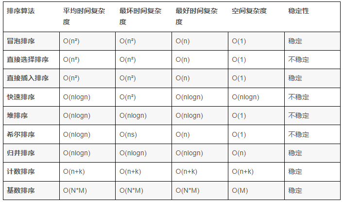
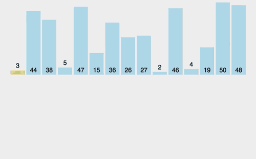
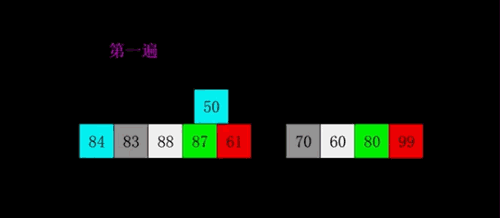

<!--
 * @Author: Lumen
 * @Date: 2022-02-27 21:24:08
 * @LastEditTime: 2022-02-27 21:33:53
 * @LastEditors: Lumen
 * @Description:
 * 👻👻👻👻👻👻👻👻
-->

# 排序

## 排序含义:把无序的数据变得有序,默认升序.笔试面试排名第一的内容

### 应该掌握的点

1. 算法描述
2. 能实现
3. 时间复杂度,空间复杂度以及稳定性
4. 优缺点

#### 稳定性:对于关键字一样的数据假如A和A',在排序前A在A'的前面,排序后如果能保证A还在A'的前面那么这个算法稳定,否则不稳定
>
> 注意:稳定性是针对算法,不针对一次具体的实现.判断稳定性简单的方法:是否有跳跃的交换数据,如果有则不稳定,没有则稳定

### 排序难点:算法多,易混淆

### 排序算法

#### 冒泡排序

> 两两比较,大的往后走

时间复杂度：$O(n^{2})$

空间复杂度：$O(1)$

稳定性：稳定

算法步骤：

> 1. 比较相邻的元素。如果第一个比第二个大，就交换它们两个
> 2. 对每一对相邻元素作同样的工作，从开始第一对到结尾的最后一对。这步做完后，最后的元素会是最大的数
> 3. 针对所有的元素重复以上的步骤，除了最后一个
> 4. 持续每次对越来越少的元素重复上面的步骤，直到没有任何一对数字需要比较

#### 选择排序

> 每次都从待排序中选出最小的一个和待排序的第一个数据交换

时间复杂度：$O(n^{2})$

空间复杂度：$O(1)$

稳定性：稳定

算法步骤：

> 1. 首先在未排序序列中找到最小（大）元素，存放到排序序列的起始位置
> 2. 从剩余未排序元素中继续寻找最小（大）元素，然后放到已排序序列的末尾
> 3. 以此类推，直到所有元素均排序完毕

#### 直接(简单)插入排序

> 越有序越快,完全有序O(n),非常重要,这个是希尔排序的基础

时间复杂度：$O(n^{2})$

空间复杂度：$O(1)$

稳定性：稳定

算法步骤：

> 1. 从第一个元素开始，该元素可以认为已经被排序
> 2. 取出下一个元素，在已经排序的元素序列中从后向前扫描
> 3. 如果该元素（已排序）大于新元素，将该元素移到下一位置
> 4. 重复步骤3，直到找到已排序的元素小于或者等于新元素的位置
> 5. 将新元素插入到该位置后
> 6. 重复步骤2~5

#### 希尔(shell)排序

> 分组后(间隔式的分组)利用直接插入排序

时间复杂度：$O(ns)$

空间复杂度：$O(1)$

稳定性：稳定

算法步骤：

> 1. 从第一个元素开始，该元素可以认为已经被排序
> 2. 取出下一个元素，在已经排序的元素序列中从后向前扫描
> 3. 如果该元素（已排序）大于新元素，将该元素移到下一位置
> 4. 重复步骤3，直到找到已排序的元素小于或者等于新元素的位置
> 5. 将新元素插入到该位置后
> 6. 重复步骤2~5

#### 快速排序

> 1. 从后往前找比基准小的数字,找到往前挪;
> 2. 从前往后找比基准大的数字,找到往后移动;
> 3. 重复1,2

快排两个缺点:空间复杂度大,不稳定

快速排序致命缺点:越有序越慢;

#### 堆排序

#### 归并排序

将两段有序的数据合并成为一段有序的数据,直到所有的数据都有序;
把两段有序的归并为一段更有序的,也成为2路归并;
空间复杂度度大(缺点),但是稳定
